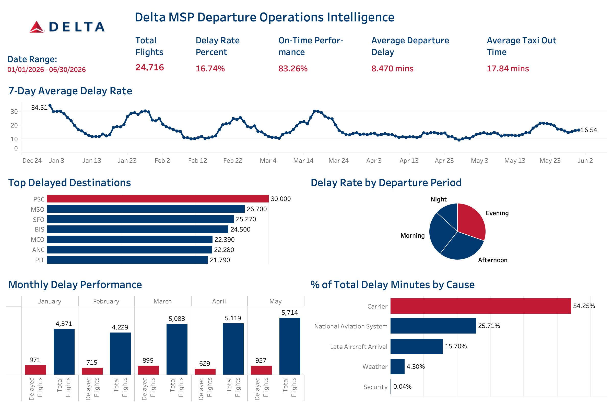

# Delta MSP Departure Operations Intelligence

## Executive Summary

The **Delta MSP Departure Operations Intelligence** project is an end-to-end data analytics solution developed to evaluate departure performance for Delta Air Lines flights originating from Minneapolis–Saint Paul International Airport.

The project transforms raw Bureau of Transportation Statistics flight data into an analytics-ready dataset using Python, stores the prepared data in PostgreSQL, creates reusable SQL analytics views, and presents the results through an executive Tableau dashboard.

The analysis covers **24,716 flights** between **January 1, 2026 and June 30, 2026**. During this period, Delta achieved an on-time departure performance of **83.26%**, while **16.74%** of flights departed more than 15 minutes late.

The project focuses on identifying operational delay patterns across destinations, departure periods, months, and reported delay causes.

---

## Business Problem

Flight delays affect airline operating costs, aircraft utilization, crew schedules, airport operations, and passenger experience.

An airline operations team needs a reliable way to answer questions such as:

- What percentage of flights depart on time?
- How does departure performance change over time?
- Which destinations experience the highest delay rates?
- Which departure periods are most exposed to delays?
- What operational categories contribute most to total delay minutes?
- Are monthly increases in delayed flights caused by worsening performance or higher flight volume?

The objective of this project was to build an analytics platform that converts detailed flight-level data into operational metrics and actionable business insights.

The analysis is limited to:

- Delta Air Lines
- Flights originating from MSP
- Departure performance
- January through June 2026

The project does not compare Delta with other airlines or MSP with other origin airports.

---

## Methodology

### 1. Data Collection

The source dataset was obtained from the U.S. Bureau of Transportation Statistics and contains detailed departure information for Delta flights originating from MSP.

The dataset includes:

- Flight date
- Flight number
- Tail number
- Destination airport
- Scheduled and actual departure times
- Scheduled and actual elapsed time
- Departure delay
- Taxi-out time
- Carrier delay
- Weather delay
- National Aviation System delay
- Security delay
- Late-arriving aircraft delay

### 2. Data Profiling

The dataset was initially profiled in Jupyter Notebook to assess:

- Dataset shape
- Data types
- Missing values
- Duplicate records
- Invalid rows
- Delay distributions
- Destination and aircraft coverage
- Extreme delay values

Metadata rows included at the end of the downloaded CSV were identified and excluded from the cleaned dataset.

### 3. Data Cleaning and Feature Engineering

Python and Pandas were used to:

- Remove non-flight metadata records
- Standardize column names using `snake_case`
- Convert date fields into date data types
- Parse scheduled and actual departure times
- Convert delay fields to numeric values
- Handle missing delay-cause values
- Create calendar attributes
- Create operational delay flags
- Categorize flights by departure period
- Create delay-severity categories
- Calculate total reported cause-delay minutes

A flight was classified as delayed when:

```text
Departure Delay > 15 minutes
```

Departure periods were defined as:

| Departure Period | Time Range  |
| ---------------- | ----------- |
| Morning          | 05:00–11:59 |
| Afternoon        | 12:00–16:59 |
| Evening          | 17:00–20:59 |
| Night            | 21:00–04:59 |

### 4. Database Development

The cleaned dataset was loaded into a PostgreSQL database through a reusable Python loading script.

Database credentials were stored locally using environment variables in a `.env` file and excluded from GitHub.

The main database table is:

```text
flight_operations
```

### 5. SQL Analytics Layer

Reusable PostgreSQL views were created to centralize metric definitions and simplify Tableau development.

The analytics layer includes:

- `vw_executive_summary`
- `vw_daily_performance`
- `vw_destination_performance`
- `vw_flight_performance`
- `vw_aircraft_performance`
- `vw_delay_causes`
- `vw_departure_time_performance`

These views support executive KPIs, time-series analysis, destination comparisons, recurring-flight analysis, aircraft-level exploration, delay-cause reporting, and departure-period analysis.

### 6. Tableau Dashboard Development

Tableau Desktop was connected directly to PostgreSQL.

The executive dashboard includes:

- Total flights
- Delay rate
- On-time performance
- Average departure delay
- Average taxi-out time
- Seven-day average delay-rate trend
- Top delayed destinations
- Delay rate by departure period
- Monthly delayed-flight and total-flight comparison
- Percentage of total delay minutes by cause

## Dashboard Preview



### 7. Validation

Dashboard metrics were validated against PostgreSQL queries before being included in the final analysis.

Special care was taken to avoid unsupported causal conclusions. For example:

- A destination with a high delay rate was not assumed to have caused the delay.
- A tail number with poor observed performance was not classified as mechanically unreliable.
- Winter delay peaks were not attributed solely to weather without supporting meteorological data.

---

## Skills

### Programming and Data Preparation

- Python
- Pandas
- NumPy
- Jupyter Notebook
- Data profiling
- Data cleaning
- Feature engineering
- Date and time processing
- Data-quality validation

### Database and SQL

- PostgreSQL
- pgAdmin
- SQLAlchemy
- `psycopg2`
- Relational database design
- SQL views
- Aggregate queries
- Conditional aggregation
- Window calculations
- Percent-of-total calculations
- Median and average analysis
- Reusable analytics layers

### Business Intelligence

- Tableau Desktop
- PostgreSQL live connections
- KPI development
- Time-series visualization
- Moving averages
- Ranking analysis
- Dashboard layout
- Tooltip formatting
- Executive reporting
- Data storytelling

### Development Practices

- VS Code
- Git
- GitHub
- Branch-based development
- Virtual environments
- Environment variables
- Modular project organization
- Technical documentation

---

## Results

### Key Performance Indicators

| Metric                  |        Result |
| ----------------------- | ------------: |
| Total Flights           |        24,716 |
| Departure Delay Rate    |        16.74% |
| On-Time Performance     |        83.26% |
| Average Departure Delay |  8.47 minutes |
| Average Taxi-Out Time   | 17.84 minutes |

### Delay Trends

The seven-day average delay rate showed pronounced peaks during portions of January, February, and March.

Several early-year periods approached or exceeded a 30% delay rate. From April onward, departure performance became more stable and generally remained below the strongest first-quarter peaks.

The dataset does not contain detailed weather, staffing, deicing, or airport congestion records, so the causes of these peaks cannot be confirmed from this dataset alone.

### Delay Causes

Reported delay minutes were distributed as follows:

| Delay Cause              | Percentage of Total Delay Minutes |
| ------------------------ | --------------------------------: |
| Carrier                  |                            54.25% |
| National Aviation System |                            25.71% |
| Late Aircraft Arrival    |                            15.70% |
| Weather                  |                             4.30% |
| Security                 |                             0.04% |

Carrier-related delay represented the largest recorded delay category.

Carrier delay may include factors such as aircraft servicing, maintenance, crew availability, fueling, cleaning, baggage loading, or other airline-controlled operational processes. The available dataset does not provide more detailed carrier-delay subcategories.

### Destination Performance

The dashboard identified the following destinations among the highest departure-delay rates:

| Destination | Delay Rate |
| ----------- | ---------: |
| PSC         |     30.00% |
| MSO         |     26.70% |
| SFO         |     25.27% |
| BIS         |     24.50% |
| MCO         |     22.39% |
| ANC         |     22.28% |
| PIT         |     21.79% |

These results indicate where departure performance from MSP was weakest. They do not establish that the destination airports caused the delays.

Destination rankings should be interpreted together with:

- Total number of flights
- Scheduled departure period
- Average and median delay
- Reported delay causes
- Recurring flight-number performance

### Departure Period Performance

Delay exposure varied across morning, afternoon, evening, and night departures.

Afternoon and evening operations represented substantial portions of the departure-period delay measure.

This pattern may be consistent with operational delay accumulation across the day, where earlier aircraft, crew, or network disruptions affect later departures. Aircraft rotation data would be required to evaluate this explanation directly.

### Monthly Performance

Monthly delayed-flight counts varied alongside total flight volume.

For example, a month with more delayed flights may also have substantially more total flights. Therefore, delayed-flight counts should not be evaluated without also considering the corresponding monthly delay rate.

---

## Business Recommendations

### 1. Investigate carrier-delay subcategories

Carrier-related issues represented approximately 54.25% of reported delay minutes.

Operational teams should separate carrier delays into more detailed categories such as:

- Aircraft servicing
- Maintenance
- Crew scheduling
- Gate readiness
- Fueling
- Cleaning
- Baggage handling

This would help identify the most actionable opportunities for delay reduction.

### 2. Compare first-quarter delay peaks with external operational data

The strongest delay-rate peaks occurred during portions of the first quarter.

Future analysis should combine flight records with:

- NOAA weather observations
- Snow and deicing conditions
- MSP airport traffic volume
- National Airspace System advisories
- Crew availability
- Aircraft availability
- Gate and ground-resource data

This would allow the operations team to distinguish seasonal, airport, airline, and network-related contributors.

### 3. Prioritize high-delay destinations using volume thresholds

Destinations should not be ranked solely by delay percentage.

Operational prioritization should consider:

- Minimum flight volume
- Delayed-flight count
- Median delay
- Total delay minutes
- Departure period
- Delay-cause composition

This prevents low-volume routes from appearing disproportionately important because of a small number of delayed flights.

### 4. Analyze late-aircraft delay across the operating day

Late-arriving aircraft contributed approximately 15.70% of reported delay minutes.

Further analysis should evaluate whether these delays become more common during afternoon and evening departures, which may indicate delay propagation across aircraft rotations.

### 5. Track normalized performance together with operational impact

Monthly reporting should include both:

- Delay rate
- Number of delayed flights

The delay rate measures normalized performance, while delayed-flight volume reflects the total operational and passenger impact.

### 6. Expand the dashboard with interactive operational filters

Future dashboard versions should include filters for:

- Flight date
- Month
- Destination
- Departure period
- Flight number
- Tail number
- Weekday versus weekend

A unified dimensional data model would allow these filters to update all dashboard components consistently.

### 7. Automate data refresh and validation

The current pipeline can be extended into an automated process that:

- Ingests newly published flight files
- Runs data-quality checks
- Updates PostgreSQL
- Rebuilds analytics views
- Refreshes the Tableau extract
- Flags unexpected schema or metric changes

This would move the project from a static portfolio analysis toward a production-style analytics solution.
